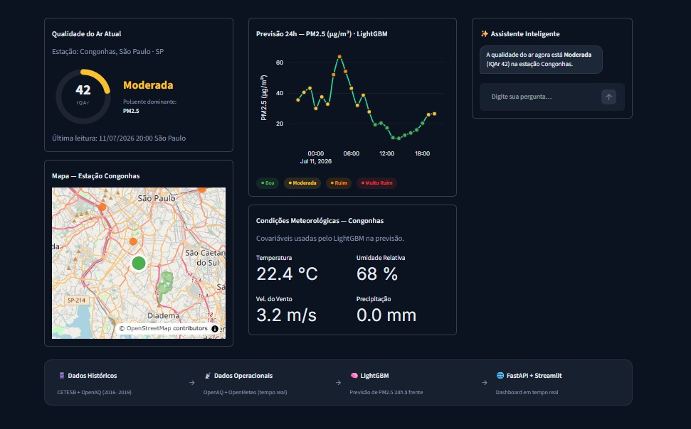
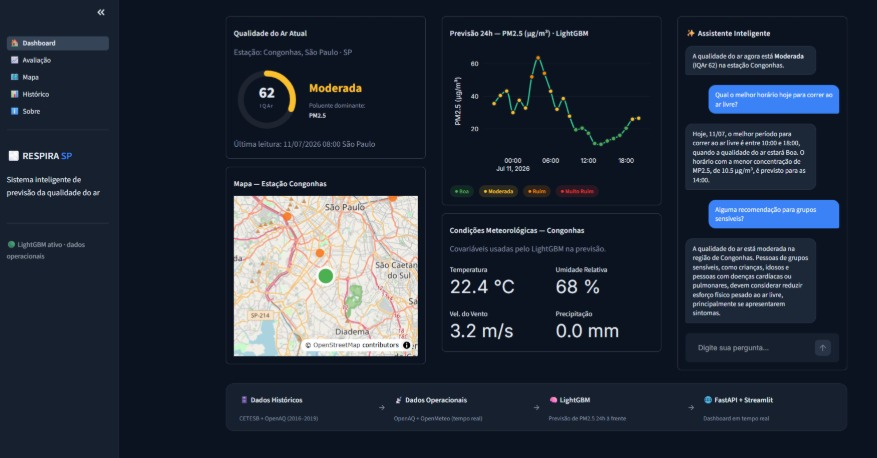
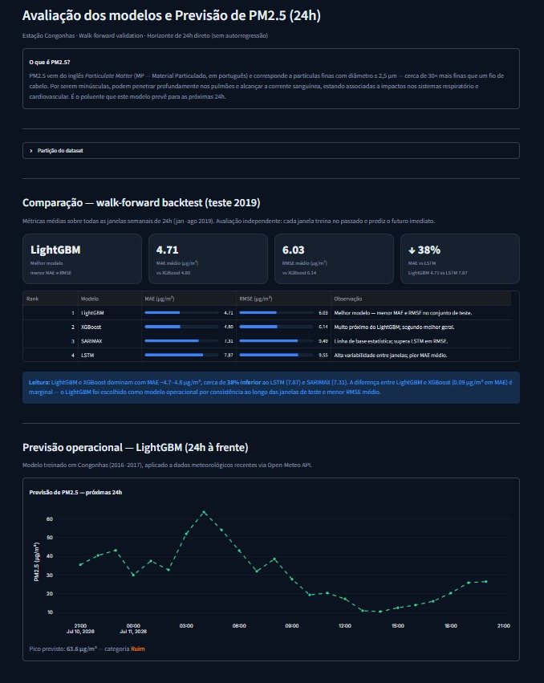
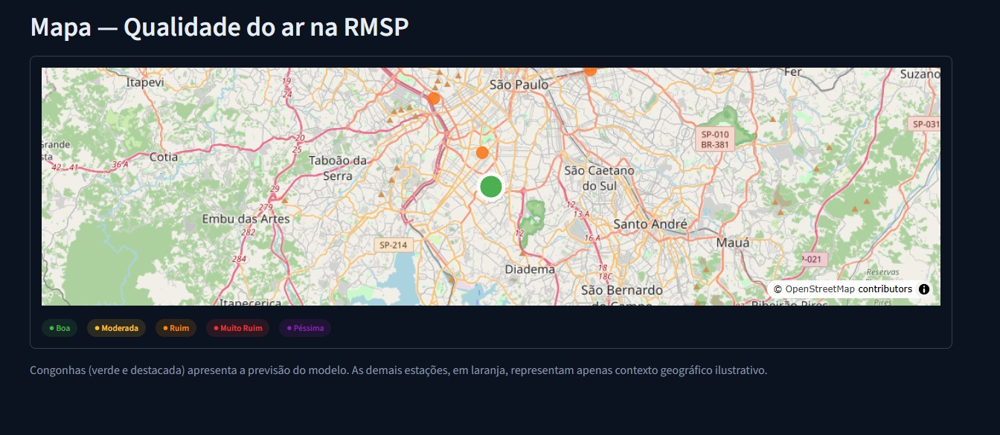
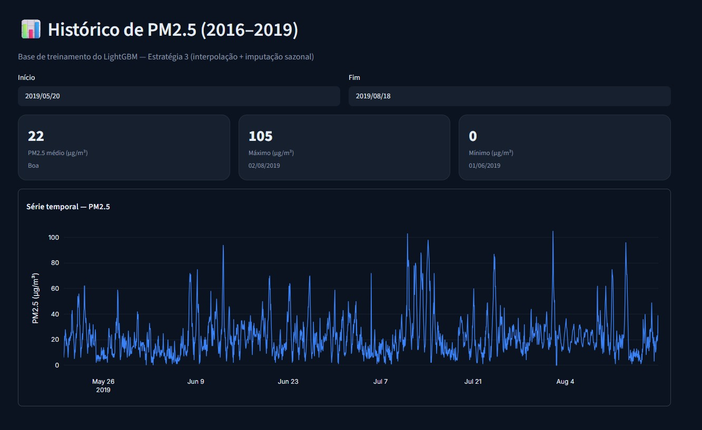
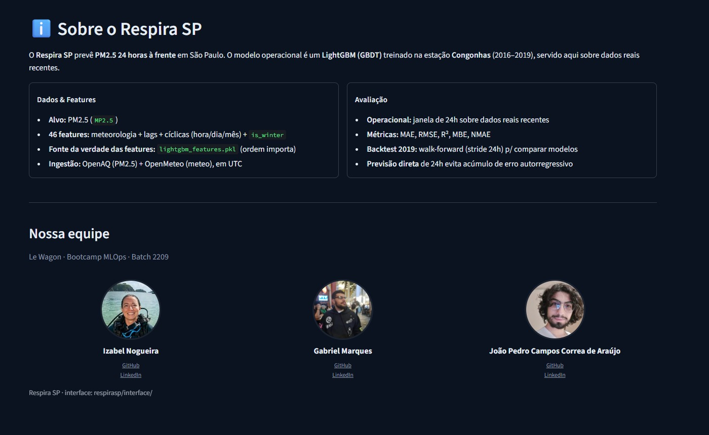
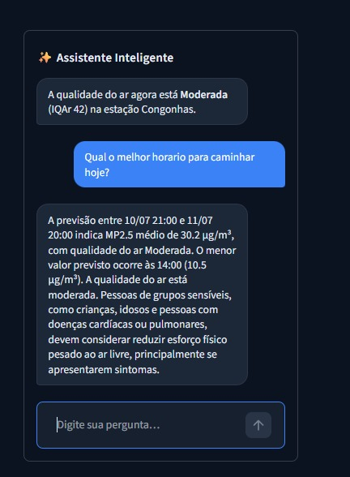
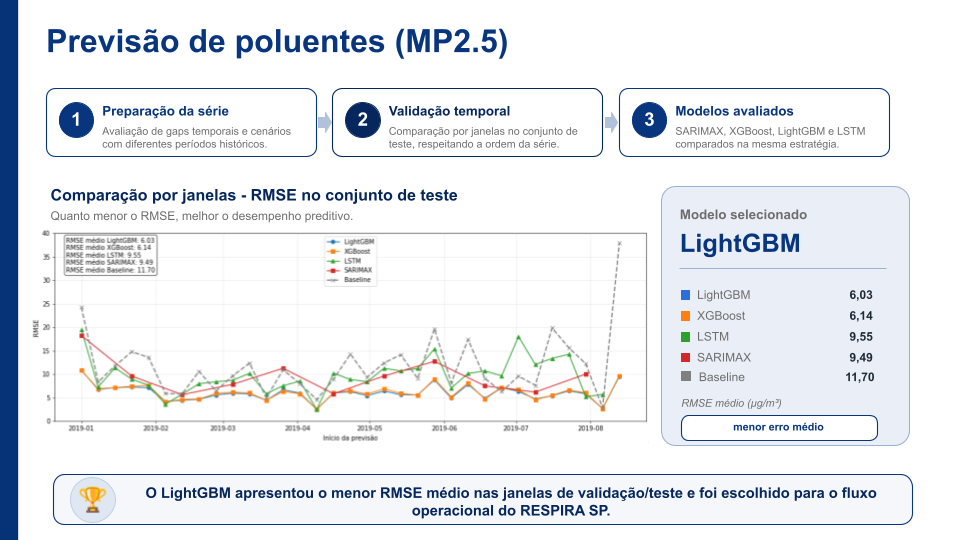
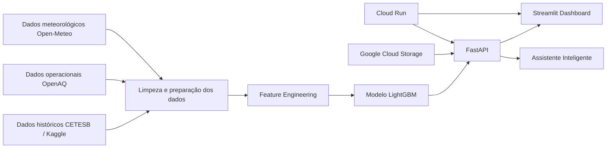

# 🌫️ Respira SP

<div align="center">

**Sistema inteligente de previsão da qualidade do ar em São Paulo**

Previsão de concentração de **MP2.5 para as próximas 24 horas**, combinando dados históricos, meteorologia, Machine Learning, MLOps, API, dashboard interativo e assistente inteligente.



</div>

---

## 📌 Sobre o projeto

O **Respira SP** é uma plataforma de previsão da qualidade do ar desenvolvida para antecipar a concentração de material particulado fino (**MP2.5**) na região de São Paulo, usando dados de poluição atmosférica e variáveis meteorológicas.

A proposta do projeto é sair de uma lógica apenas de monitoramento e avançar para uma solução de **antecipação de risco**, permitindo que usuários consultem previsões para as próximas 24 horas, visualizem tendências e recebam explicações contextualizadas por meio de um assistente inteligente.

O MVP utiliza a estação de **Congonhas, São Paulo - SP** como referência operacional e apresenta previsões em uma interface web construída com **Streamlit**, consumindo uma API desenvolvida com **FastAPI**.

---

## 🎯 Objetivos

- Monitorar a qualidade do ar com dados operacionais.
- Prever concentrações futuras de **MP2.5** para um horizonte de 24 horas.
- Relacionar poluição atmosférica com variáveis meteorológicas.
- Disponibilizar visualizações simples para interpretação das previsões.
- Transformar previsões numéricas em respostas compreensíveis por meio de um assistente inteligente.
- Criar uma base técnica para futuras expansões, como novas estações, novos poluentes e alertas preventivos.

---

## 🧠 Problema

A poluição atmosférica é um risco relevante para a saúde pública, especialmente em grandes centros urbanos como São Paulo, onde alta densidade populacional, frota veicular intensa e atividade urbana contribuem para episódios recorrentes de piora na qualidade do ar.

Hoje, grande parte das soluções disponíveis se concentra em **monitorar** a qualidade do ar. O Respira SP busca complementar esse processo com uma abordagem preditiva: **antecipar períodos críticos para apoiar decisões preventivas**.

---

## 🚀 Produto final

O produto final é um dashboard web que apresenta:

- Indicador atual de qualidade do ar.
- Previsão de MP2.5 para as próximas 24 horas.
- Condições meteorológicas utilizadas pelo modelo.
- Mapa da estação de referência.
- Histórico e dados operacionais.
- Assistente inteligente para perguntas sobre a previsão.



---

## 🖼️ Screenshots

> Sugestão de organização das imagens no repositório:
>
> ```text
> assets/readme/
> ├── dashboard.png
> ├── avaliacao.png
> ├── mapa.png
> ├── historico.png
> ├── sobre.png
> ├── assistente-ia.png
> ├── arquitetura.png
> ├── comparacao-modelos.png
> └── produto-final.png
> ```

### Dashboard

Visão principal com indicador atual, previsão 24h, meteorologia, mapa e assistente inteligente.


### Avaliação do modelo

Página com métricas e comparação de desempenho dos modelos avaliados.



### Mapa

Visualização geográfica da estação de referência e contexto espacial dos dados.



### Histórico

Consulta de dados históricos e comportamento temporal da série de MP2.5.



### Sobre

Página explicativa com objetivo do projeto, contexto, fontes de dados e arquitetura geral.



### Assistente inteligente

Componente de IA que traduz previsões e contexto oficial em respostas em linguagem natural.



---

## 🧪 Modelagem

O projeto comparou diferentes abordagens para previsão de séries temporais e regressão supervisionada:

- **SARIMAX**
- **XGBoost**
- **LightGBM**
- **LSTM**

Durante a avaliação, o **LightGBM** apresentou o menor erro médio entre os modelos testados e foi selecionado para o fluxo operacional do MVP.



### Resultado da avaliação

| Modelo | RMSE médio |
|---|---:|
| LightGBM | 6.03 |
| XGBoost | 6.14 |
| SARIMAX | 9.49 |
| LSTM | 9.55 |
| Baseline | 11.70 |

---

## 🧩 Arquitetura da solução

O fluxo do Respira SP combina dados históricos, dados operacionais, preprocessamento, modelo preditivo, API e interface web.



---

## 📊 Fontes de dados

### Qualidade do ar

**Treinamento**

- CETESB / Kaggle — Air Pollution at São Paulo, Brazil, since 2013.

**Operação**

- OpenAQ — dados operacionais recentes de MP2.5 para a estação de referência.

### Meteorologia

- Open-Meteo — variáveis meteorológicas horárias utilizadas como covariáveis do modelo.

---

## 🛠️ Tecnologias utilizadas

### Data Science e Machine Learning

- Python
- Pandas
- NumPy
- Scikit-learn
- LightGBM
- XGBoost
- Prophet
- LSTM
- Statsmodels
- Matplotlib

### Backend e API

- FastAPI
- Uvicorn
- Pydantic
- Joblib

### Frontend

- Streamlit
- Plotly
- Folium / mapas interativos

### MLOps e Cloud

- Docker
- Docker Compose
- Google Cloud Platform
- Google Cloud Run
- Google Cloud Storage
- Cloud Scheduler
- Artifact Registry

---

## 📁 Estrutura sugerida do projeto

```text
respirasp/
├── data/
│   ├── raw/
│   ├── processed/
│   └── operational/
├── models/
│   └── lightgbm_pm25.pkl
├── notebooks/
├── respirasp/
│   ├── api/
│   │   └── fast.py
│   ├── interface/
│   │   ├── app.py
│   │   └── views/
│   ├── ml_logic/
│   │   ├── data.py
│   │   ├── preprocessor.py
│   │   └── gcs_storage.py
│   └── params.py
├── assets/
│   └── readme/
├── Dockerfile.api
├── Dockerfile.app
├── docker-compose.yml
├── requirements.txt
└── README.md
```

---

## ⚙️ Como rodar localmente

### 1. Clone o repositório

```bash
git clone <URL_DO_REPOSITORIO>
cd respirasp
```

### 2. Crie e ative o ambiente virtual

Com `pyenv`:

```bash
pyenv virtualenv 3.12.9 respira_sp
pyenv local respira_sp
```

Ou com `venv`:

```bash
python -m venv .venv
source .venv/bin/activate
```

### 3. Instale as dependências

```bash
python -m pip install --upgrade pip
python -m pip install -r requirements.txt
python -m pip install -e .
```

### 4. Configure as variáveis de ambiente

Crie um arquivo `.env` na raiz do projeto:

```env
MODEL_TARGET=local
USE_GCS_STORAGE=False
OPENAQ_API_KEY=sua_chave_openaq
RESPIRA_API_URL=http://localhost:8000
```

> Para rodar apenas com arquivos locais em `data/operational/`, mantenha `USE_GCS_STORAGE=False`.

---

## ▶️ Como subir o backend localmente

Se o frontend estiver mostrando **“API indisponível”**, normalmente significa que a API não está rodando ou que a variável `RESPIRA_API_URL` está apontando para o lugar errado.

Em um terminal, suba a API:

```bash
export USE_GCS_STORAGE=False
export MODEL_TARGET=local

uvicorn respirasp.api.fast:app \
  --reload \
  --host 0.0.0.0 \
  --port 8000
```

Teste se a API está online:

```bash
curl http://localhost:8000/
```

Resposta esperada:

```json
{"status": "Respira SP API online"}
```

Teste a previsão:

```bash
curl http://localhost:8000/forecast
```

Se o endpoint `/forecast` retornar erro de arquivo ausente, confira se existem arquivos operacionais em:

```text
data/operational/
```

com nomes parecidos com:

```text
openaq_location_6139516_YYYYMMDD.csv
openmeteo_operacional_YYYYMMDD.csv
```

---

## 🖥️ Como subir o frontend localmente

Em outro terminal:

```bash
export RESPIRA_API_URL=http://localhost:8000
streamlit run respirasp/interface/app.py
```

O Streamlit abrirá em:

```text
http://localhost:8501
```

Se o comando `streamlit` não funcionar:

```bash
python -m streamlit run respirasp/interface/app.py
```

---

## 🐳 Rodando com Docker Compose

Também é possível subir API e frontend juntos:

```bash
docker compose up --build
```

Com o `docker-compose.yml` do projeto, os serviços ficam disponíveis em:

```text
Frontend: http://localhost:8000
API:      http://localhost:8501
```

Teste a API no Docker:

```bash
curl http://localhost:8501/
curl http://localhost:8501/forecast
```

---

## ☁️ Deploy na Google Cloud

O projeto foi estruturado para deploy em dois serviços no Cloud Run:

- `respirasp-api` — backend FastAPI.
- `respirasp` — frontend Streamlit.

### Build e deploy da API

```bash
PROJECT_ID="seu-project-id"
REGION="europe-west1"
REPO="respirasp"
BUCKET_NAME="${PROJECT_ID}-respirasp-operational-data"
API_IMAGE="$REGION-docker.pkg.dev/$PROJECT_ID/$REPO/respirasp-api:latest"

rm -f Dockerfile
cp Dockerfile.api Dockerfile

gcloud builds submit --tag "$API_IMAGE"

gcloud run deploy respirasp-api \
  --image "$API_IMAGE" \
  --region "$REGION" \
  --allow-unauthenticated \
  --set-env-vars USE_GCS_STORAGE=True,GCS_BUCKET_NAME="$BUCKET_NAME",GCS_OPERATIONAL_PREFIX=operational,OPENAQ_API_KEY="SUA_CHAVE_OPENAQ"

rm Dockerfile
```

### Build e deploy do frontend

```bash
APP_IMAGE="$REGION-docker.pkg.dev/$PROJECT_ID/$REPO/respirasp-app:latest"
API_URL="https://URL-DA-SUA-API-CLOUD-RUN"

rm -f Dockerfile
cp Dockerfile.app Dockerfile

gcloud builds submit --tag "$APP_IMAGE"

gcloud run deploy respirasp \
  --image "$APP_IMAGE" \
  --region "$REGION" \
  --allow-unauthenticated \
  --set-env-vars RESPIRA_API_URL="$API_URL"

rm Dockerfile
```

---

## 🧭 Endpoints principais

| Método | Endpoint | Descrição |
|---|---|---|
| GET | `/` | Verifica se a API está online |
| GET | `/forecast` | Retorna a previsão de MP2.5 para as próximas 24 horas |
| GET | `/update` | Atualiza os dados operacionais e salva os arquivos mais recentes |

---

## 🤖 Assistente inteligente

O assistente inteligente foi criado para tornar a previsão mais compreensível para o usuário final. Em vez de entregar apenas um número, ele combina:

- previsão numérica de MP2.5;
- faixas de qualidade do ar;
- orientações de risco à saúde;
- pergunta do usuário.

Com isso, o sistema consegue responder perguntas como:

> “Posso correr amanhã de manhã?”

A resposta é contextualizada com base na previsão e nas recomendações de qualidade do ar.

---

## 🔮 Possíveis evoluções

- Expandir a cobertura para outras estações da CETESB.
- Adicionar novos poluentes, como MP10, O₃ e NO₂.
- Criar alertas inteligentes para grupos vulneráveis.
- Integrar dados de saúde pública para avaliar impacto de episódios de poluição.
- Evoluir o assistente de IA para recomendações mais personalizadas.
- Criar visualização espacial da qualidade do ar no estado de São Paulo.

---

## 👥 Time

- Izabel Nogueira
- Gabriel Pires
- João Pedro de Araujo

---

## 📄 Licença

Este projeto foi desenvolvido com fins educacionais como projeto final do bootcamp de Data Science & AI da Le Wagon.

---

<div align="center">

**Respira SP — Antecipar para prevenir.**

</div>
